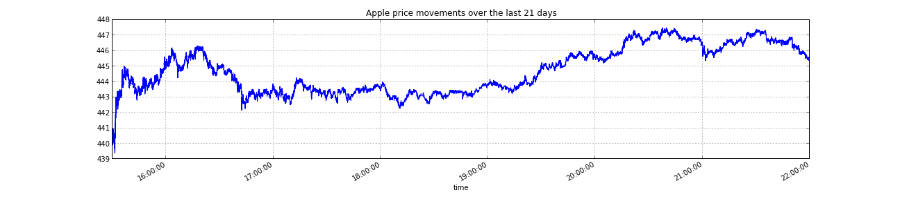

Lime
====

An API for extracting tick data for US equities for ad-hoc analysis in Python with Pandas.

Currently lime supports two main work horse functions:

*  `get_single(date, stock_ticker,)` - retrives a single days trading history returned in a nice neat pandas dataframe. 
*  `get_many(date_range, stock_ticker)` - retrives tick data over a range of dates, and compiles those dates in a nice neat dataframe for easy output.

*Additional functions are included to make this process easier.*

###Examples:

#### Getting a single day's trading history:

#### Getting  the last three weeks:

*A basic demo of what lime can do will is located [here](http://nbviewer.ipython.org/urls/raw.github.com/agconti/lime/master/assets/demo/lime_demo.ipynb).*

### Improvements

Currently, lime can get the tick data for any US trade stock, but this is limiting. 

Planned enhancements are:

*  support for any US security 
*  support for international securities
*  support for passing a list of tickers / securities for easy analysis

###Name Etymology
After getting a lot of ticks (tick bites), you get lime.  

All submissions are welcome. To submit a change, fork this repo, commit your changes, and send me a [pull request](http://help.github.com/send-pull-requests/).

